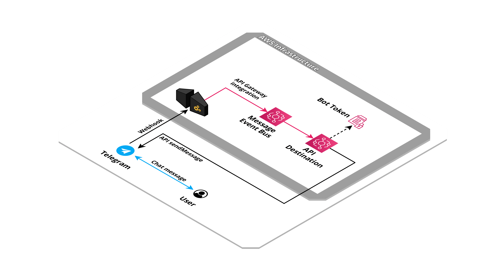

# AWS Serverless Telegram Bot Connector


This is a serverless application that implements a Telegram bot connector for message receive and send.

## Created resources

This application create an API Gateway endpoint to listen for webhook request, an Event Bridge bus to send received messages.



## Installation

Using the [SAM CLI](https://docs.aws.amazon.com/serverless-application-model/latest/developerguide/what-is-sam.html):
```bash
sam deploy --guided
```

Optionally deploy the example process handlers for `/start`, `/keyboard`, `/inline` and `/webapp` commands:
```bash
sam deploy --template template.process.yaml --guided
```
or a session example with command `/ask`, `/cancel`:
```bash
sam deploy --template template.session.yaml --guided
```
or a bedrock example:
```bash
sam deploy --template template.bedrock.yaml --guided
```

## Parameters

- **TelegramBotToken**: Telegram bot token.

- **TelegramIPsWhitelist**: Comma separate list of IPs of permitted [senders IP](https://core.telegram.org/bots/webhooks#the-short-version), leave empty to disable whitelist.

- **TelegramApiEndpoint**: Telegram API endpoint.

- **EventsLogRetentionInDays**: Log retention in days.

- **UsernameWhitelist**: Allowed usernames, separated by comma.

- **WelcomeText**: Bot welcome text sent when receiving "/start" command.

## Outputs

- **WebhookEndpoint**: The Telegram bot Webhook URL.

- **EventBusName**: Name of EventBridge bus where message event are sent.

- **LogGroupForEvents**: Name of CloudWatch Log Group for EventBridge events logging.

## Telegram bot configurations

Create a new bot talking to **@BotFather** and copy the provide token (needed for **TelegramBotToken** parameter).

### Check Webhook

A StepFunction triggered by stack created event will automatically register the webhook using the [setWebhook](https://core.telegram.org/bots/api#setwebhook) bot API.

In order to check if the webhook is correctly registered navigating to `https://api.telegram.org/bot<here the bot token>/getWebhookInfo`, you should see a response like this:
```json
{"ok":true,"result":{"url":"https://xxxxxxxxxxxx.execute-api.eu-west-1.amazonaws.com/webhook/","has_custom_certificate":false,"pending_update_count":0,"max_connections":40,"ip_address":"0.0.0.0"}}
```

If the response is empty the webhook wasn't registered correctly:
```json
{"ok":true,"result":{"url":"","has_custom_certificate":false,"pending_update_count":0}}
```

Set the WebHook URL endpoint (retrieved from **WebhookEndpoint** stack output after the first deploy) navigating to: `https://api.telegram.org/bot<here the bot token>/setWebhook?url=<here the webhook endpoint url>`. 

You should see a response like this:
```json
{"ok":true,"result":true,"description":"Webhook was set"}
```

## Receive a webhook event

When a message is sent to the bot (and the username whitelist pass) this application send an event to the **exported EventBridge bus** with the following format:
```js
{
    "source": "org.telegram.webhook",
    "detail-type": "Webhook Event Received",
    "detail": {
      "message": {
          "message_id": 6,
          "from": {
              /** [...] */
          },
          "chat": {
              /** [...] */
          },
          "date": 1708773749,
          "text": "/start",
          "entities": []
      }
    }
}
```

More information about events payload can be found on the [Telegram documentation page](https://core.telegram.org/bots/webhooks).

## Api and actions

Telegram APIs can be invoked sending an event into the **exported EventBridge bus**.

### Send chat action

To trigger a chat event send an event with the following format:
```json
{
  "detail-type": "Send Chat Action",
  "detail": {
    "chat_id": 1234567,
    "action": "typing"
  }
}
```

### Send a message

In order to send a message through the Telegram bot send an event with the following format:
```json
{
  "detail-type": "Send Message",
  "detail": {
    "chat_id": 1234567,
    "text": "this is an **example** message"
  }
}
```

### Edit a message

To edit a previously sent message:
```json
{
  "detail-type": "Edit Message",
  "detail": {
    "chat_id": 1234567,
    "message_id": 89012345,
    "text": "this is an **example** message (edited)"
  }
}
```

It is common to use this API when receiving the button press callback from the inline keyboard to delete buttons.

### Inline keyboard

Send a message with an inline buttons:
```json
{
  "detail-type": "Send Message",
  "detail": {
    "chat_id": 1234567,
    "text": "Select a response:",
    "keyboard": [{ "text": "Yes", "callback_data": "yes" }, { "text": "No", "callback_data": "no" }]
  }
}
```

Receive the callback event when the user click on one of the buttons:
```js
{
    "source": "org.telegram.webhook",
    "detail-type": "Webhook Event Received",
    "detail": {
      "callback_query": {
          "id": "",
          "from": {
              /** [...] */
          },
          "message": {
              "message_id": 18,
              "from": {
                  /** [...] */
              },
              "chat": {
                  /** [...] */
              },
              "date": 1708776729,
              "text": "/command",
              "entities": [],
              "reply_markup": {
                  "inline_keyboard": [
                      [
                          {
                              "text": "Stop",
                              "callback_data": "string"
                          }
                      ]
                  ]
              }
          },
          "chat_instance": "",
          "data": "string"
      }
  }
}
```

### Keyboard

Send a message with custom keyboard buttons:
```json
{
  "detail-type": "Send Message With Keyboard",
  "detail": {
    "chat_id": 1234567,
    "text": "Select a response:",
    "keyboard": [
      [{ "text": "Yes" }, { "text": "No"  }],
      [{ "text": "Cancel" }]
    ]
  }
}
```

When user click on one button a message is automatically sent with the content of "text" property.

## WebApp

Send a message with custom keyboard button that open a web app:
```json
{
  "detail-type": "Send Message With Keyboard",
  "detail": {
    "chat_id": 1234567,
    "text": "Open web app from keyboard:",
    "keyboard": [
      [{ "text": "Open", "web_app": { "url": "https://example.com" } }]
    ]
  }
}
```

A super easy example can be found into the HTML file `webapp/index.html`. 
It just describe the Telegram library:
```html
<script src="https://telegram.org/js/telegram-web-app.js" onload="init()"></script>
```
its initialization:
```js
function init(params) {
  console.log('Telegram WebApp ready!');

  var WebApp = window.Telegram.WebApp;
  console.log({ WebApp });
  WebApp.ready();
}
```
a simple form:
```html
<form id="form">
  <p>
    <label for="input1">
      Input 1
    </label>
    <input name="input1" id="input1" type="text" />
  </p>
  <p>
    <label for="input2">
      Input 2
    </label>
    <input name="input2" id="input2" type="text" />
  </p>
</form>
```
and the main button action handler:
```js
var MainButton = WebApp.MainButton;
  console.log({ MainButton });

  MainButton.setText('Ok');
  MainButton.show();
  MainButton.enable();
  MainButton.onClick((event) => {
    var form = document.getElementById('form')
    var formData = new FormData(form)

    // click handler
  });
```

Using `WebApp.sendData` the web app will return back information:
```js
// click handler
WebApp.sendData(JSON.stringify({ 
  input1: formData.get('input1'),
  input2: formData.get('input2')
}));
```

The webhook endpoint will receive a callback event containing the data, here the corresponding event:
```js
{
    "source": "org.telegram.webhook",
    "detail-type": "Webhook Event Received",
    "detail": {
      "message": {
          "message_id": 1234567,
          "from": {
              /** [...] */
          },
          "chat": {
              /** [...] */
          },
          "web_app_data": {
            "data": "{\"test\": 123}"
          }
      }
    }
}
```

## Inline mode

You can enable the inline mode for your bot taking talking to **@BotFather**.
Once enabled the bot can be triggered via an inline search from message, like:
```
@my_bot_name_bot test
``` 

When a user stop typing the search query the webhook endpoint will receive a callback event containing the data, here the corresponding event:
```js
{
    "source": "org.telegram.webhook",
    "detail-type": "Webhook Event Received",
    "detail": {
      "inline_query": {
          "id": 1234567,
          "from": {
              /** [...] */
          },
          "query": "test"
      }
    }
}
```

Answer to the request sending an event like:
```json
{
  "detail-type": "Answer Inline Query",
  "detail": {
    "inline_query_id": 1234567,
    "results": [
      
    ]
  }
}
```

More information about results response can be found on the [Telegram documentation page](https://core.telegram.org/bots/api#answerinlinequery).

## Credits

- Repository badges by [Shields.io](https://shields.io/)
- Infrastructure schema by [Cloudcraft](https://www.cloudcraft.co/)
